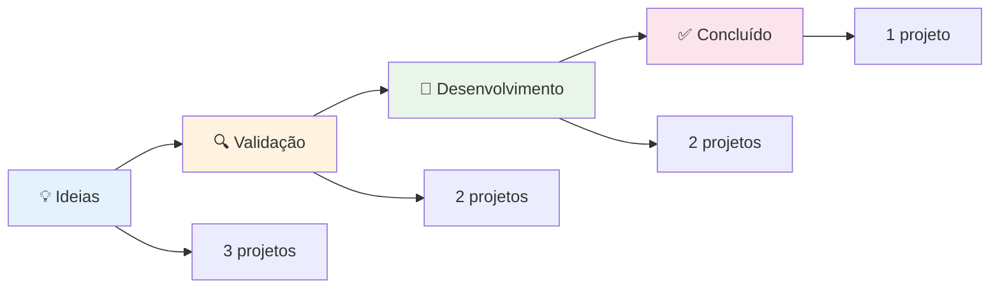
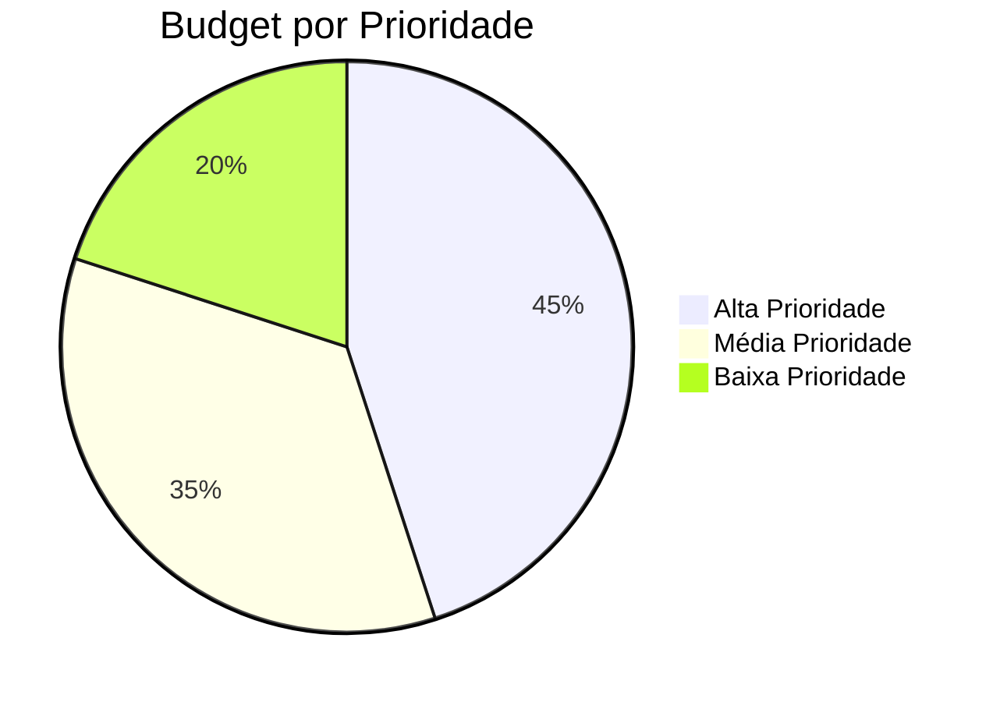
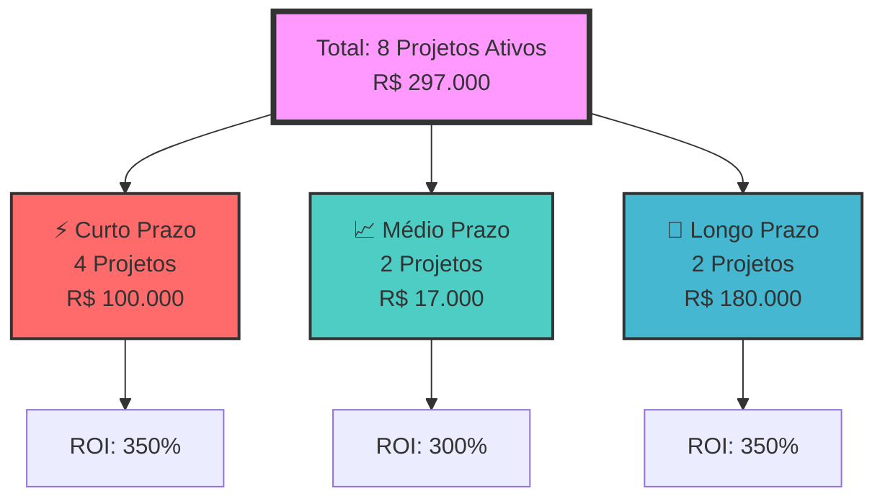
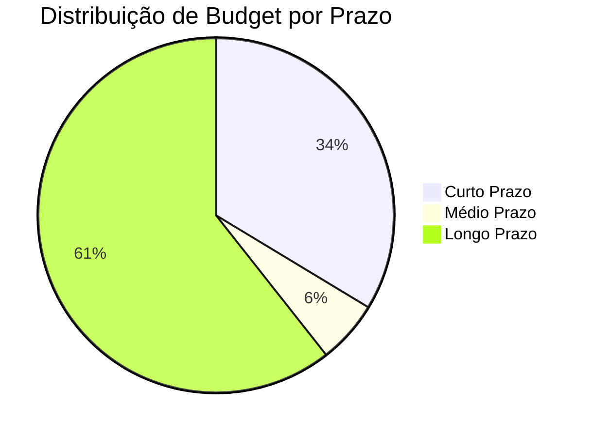
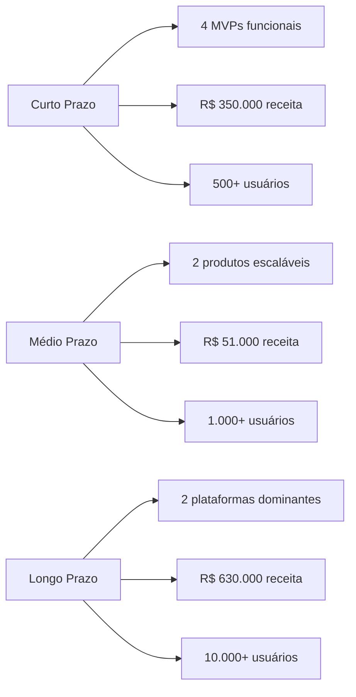

# 🏢 **<%= tp.file.title %>**

> *Dashboard visual padronizado com estilo AERALYN*

---

# 🏢 **<%= tp.file.title %>**

> *Dashboard visual padronizado com estilo AERALYN*

---

<div class="dashboard-header">
### 🎯 **RESUMO EXECUTIVO**
# 📝 **NOVA IDEIA DE PROJETO**

> *Template simplificado para submeter ideias de projeto*

---

## 🎯 **INFORMAÇÕES BÁSICAS**

### **Título do Projeto**
*Nome curto e claro para o projeto*

# 🏢 **<%= tp.file.title %>**

> *Dashboard visual padronizado com estilo AERALYN*

---

<div class="dashboard-header">
### 🎯 **RESUMO EXECUTIVO**
- **Total de Projetos**: 8 projetos ativos
- **Budget Total**: R$ 297.000
- **ROI Médio**: 347%
- **Status Geral**: ✅ **Sistema Funcionando**
</div>

## 📊 **MÉTRICAS PRINCIPAIS**

<div class="metric-grid">

<div class="metric-card metric-card-success">
### 🚀 **PROJETOS ATIVOS**
**8 Projetos**
**Status**: ✅ Funcionando
**Tendência**: ↗️ Crescendo
</div>

<div class="metric-card metric-card-warning">
### 💰 **BUDGET TOTAL**
**R$ 297.000**
**Utilizado**: 65%
**Disponível**: R$ 103.950
</div>

<div class="metric-card metric-card-info">
### 📈 **ROI PROJETADO**
**347%**
**Receita**: R$ 1.031.000
**Lucro**: R$ 734.000
</div>

<div class="metric-card metric-card-danger">
### ⚡ **EFICIÊNCIA**
**85%**
**Projetos no Prazo**: 6/8
**Qualidade**: ⭐⭐⭐⭐⭐
</div>

</div>

## 🚀 **PIPELINE DE INOVAÇÃO**

<div class="section-header">
### **Status dos Projetos por Fase**
</div>



## 💰 **PERFORMANCE FINANCEIRA**

<div class="section-header">
### **Distribuição de Budget por Prioridade**
</div>



## 👥 **EQUIPE E PERFORMANCE**

<div class="section-header">
### **Produtividade por Área**
</div>

<div class="area-grid">

<div class="area-card area-card-tech">
### 🖥️ **TECNOLOGIA**
**Projetos**: 3 ativos
**Eficiência**: 92%
**Tendência**: ↗️ Crescendo
</div>

<div class="area-card area-card-commercial">
### 💼 **COMERCIAL**
**Projetos**: 2 ativos
**Eficiência**: 88%
**Tendência**: ↗️ Estável
</div>

<div class="area-card area-card-operations">
### ⚙️ **OPERAÇÕES**
**Projetos**: 2 ativos
**Eficiência**: 85%
**Tendência**: → Estável
</div>

<div class="area-card area-card-marketing">
### 📢 **MARKETING**
**Projetos**: 1 ativo
**Eficiência**: 78%
**Tendência**: ↗️ Melhorando
</div>

</div>

## ⚠️ **ALERTAS E NOTIFICAÇÕES**

<div class="callout-warning">
### ⚠️ **ATENÇÃO**
- **Projeto X** precisa de revisão de budget
- **Deadline** próximo para entrega Y
- **Recursos** limitados na área Z
</div>

<div class="callout-success">
### ✅ **SUCESSOS**
- **Projeto A** concluído com sucesso
- **Meta B** atingida antes do prazo
- **Equipe C** superou expectativas
</div>

## 📋 **PRÓXIMAS AÇÕES**

| Ação | Responsável | Prazo | Status |
|------|-------------|-------|--------|
| Revisão de budget | PV | 2025-09-05 | 🔄 Em andamento |
| Entrega projeto X | Equipe | 2025-09-10 | ⏳ Pendente |
| Reunião estratégica | Todos | 2025-09-15 | 📅 Agendada |

## 🔗 **LINKS RÁPIDOS**

- [[0-Dashboard-Executivo/Home-Executivo|🏠 Home Executivo]]
- [[0-Dashboard-Executivo/Innovation-Pipeline|🚀 Innovation Pipeline]]
- [[0-Dashboard-Executivo/KPIs-Principais|📊 KPIs Principais]]
- [[4-Projetos/|📁 Projetos]]
- [[6-Reunioes/|🤝 Reuniões]]

---

**Última Atualização**: <% tp.date.now("YYYY-MM-DD HH:mm") %>
**Próxima Revisão**: <% tp.date.now("YYYY-MM-DD", 7) %>

### **Problema / Dor**
*Qual dor real do mercado este projeto resolve?*

### **Público-alvo**
*Quem são os clientes potenciais? (Ex: escritórios de advocacia, clínicas)*

### **Proposta de Solução**
*Como o projeto resolve o problema (serviço, produto, automação)*

### **Dono do Projeto**
*Quem está liderando a iniciativa*

---

## 📊 **DETALHES ADICIONAIS**

### **Esforço Estimado**
- **Duração**: ___ semanas
- **Budget**: R$ ___
- **Prioridade**: [ ] Baixa [ ] Média [ ] Alta [ ] Crítica

### **Métrica de Sucesso**
*Como medir se o projeto foi bem-sucedido?*

### **Recursos Necessários**
*Que recursos precisamos? (pessoas, ferramentas, etc.)*

---

## ✅ **CHECKLIST DE SUBMISSÃO**

- [ ] Todas as informações básicas preenchidas
- [ ] Proposta de solução clara
- [ ] Público-alvo definido
- [ ] Métrica de sucesso estabelecida
- [ ] Dono do projeto identificado

---

## 📋 **PRÓXIMOS PASSOS**

1. **Submeter** este template no repositório central
2. **Agendar** reunião de discussão específica
3. **Validar** viabilidade técnica e comercial
4. **Aprovar** ou solicitar ajustes

---

**Status**: 📝 **RASCUNHO**  
**Submetido por**: {{user}}  
**Data**: 08/04/2025  
**Próxima Ação**: Reunião de discussão
template: projeto-empresarial
type: pilot
status: idea
priority: medium
owner: "[[Seu Nome]]"
market_segment: Tecnologia
effort_weeks: 4
budget: 10000
kpi_primary: 3 clientes teste no primeiro mês
validation_score: 0
ia_assets:
  prompts:
    - Análise de dados
  models:
    - GPT-4
  datasets:
    - Dados de teste
compliance_level: 1
legal_review: false
hypothesis_id: HYP-001
pilot_stage: design
sample_size: 10
consent_required: false
data_schema: schema_v1
gating_criteria: validation_score >= 2.5
tags: []
created: 2025-08-31
modified: 2025-08-31
version: 1
updated: 2025-08-31T21:56
---
  "{ date }":
modified:
  "{ date }":
updated: 2025-08-31T21:25
---

# Dashboard-Projetos-Prazo-Visual

> *Piloto/experimento para validar conceito*

---

## 🧪 **RESUMO DO PILOTO**

### **Hipótese a Testar**
[Descrever a hipótese principal que este piloto vai validar]

### **Objetivo do Teste**
[Explicar o que queremos descobrir com este piloto]

### **Critério de Sucesso**
[Definir claramente o que consideramos sucesso]

---

## 📊 **METODOLOGIA**

### **Abordagem**
- **Tipo de Teste**: [A/B, MVP, Protótipo, etc.]
- **Duração**: {{effort_weeks}} semanas
- **Amostra**: [Tamanho e perfil da amostra]

### **Variáveis Testadas**
- [ ] Variável 1
- [ ] Variável 2
- [ ] Variável 3

### **Métricas de Validação**
- **Métrica Primária**: {{metrics_first_month}}
- **Métricas Secundárias**: [Lista]
- **Métricas de Qualidade**: [Lista]

---

## 🎯 **CRONOGRAMA DO PILOTO**

### **Semana 1: Preparação**
- [ ] Setup do ambiente
- [ ] Recrutamento de participantes
- [ ] Preparação de materiais

### **Semana 2-3: Execução**
- [ ] Execução dos testes
- [ ] Coleta de dados
- [ ] Observações qualitativas

### **Semana 4: Análise**
- [ ] Processamento dos dados
- [ ] Análise dos resultados
- [ ] Preparação do relatório

---

## 📈 **RESULTADOS ESPERADOS**

### **Cenário Otimista**
- [Resultado esperado se tudo der certo]

### **Cenário Realista**
- [Resultado mais provável]

### **Cenário Pessimista**
- [Resultado se as coisas não funcionarem]

### **Gatilhos para Escala**
- [Condições que justificariam escalar o projeto]

---

## 🛠️ **RECURSOS NECESSÁRIOS**

### **Recursos Humanos**
- **Owner**: {{owner}}
- **Equipe**: [Lista de membros]
- **Participantes**: [Perfil dos testadores]

### **Recursos Técnicos**
- **Ferramentas**: [Lista de ferramentas]
- **Infraestrutura**: [Recursos necessários]
- **Orçamento**: R$ {{budget}}

### **Recursos de IA**
{{ia_assets.prompts}}
{{ia_assets.models}}
{{ia_assets.datasets}}

---

## 🔍 **PLANO DE ANÁLISE**

### **Dados a Coletar**
- [ ] Métricas quantitativas
- [ ] Feedback qualitativo
- [ ] Observações comportamentais
- [ ] Dados de performance

### **Métodos de Análise**
- [ ] Análise estatística
- [ ] Análise qualitativa
- [ ] Comparação com benchmarks
- [ ] Análise de tendências

### **Critérios de Decisão**
- **Continuar**: [Critérios para prosseguir]
- **Pivotar**: [Critérios para mudar direção]
- **Parar**: [Critérios para encerrar]

---

## 🔒 **COMPLIANCE E ÉTICA**

### **Nível de Compliance**
**Nível {{compliance_level}}**: 
- **1 (Básico)**: Sem dados pessoais
- **2 (Dados)**: Com dados pessoais
- **3 (Crítico)**: Dados sensíveis

### **Considerações Éticas**
- [ ] Consentimento informado obtido
- [ ] Privacidade dos participantes protegida
- [ ] Dados anonimizados quando possível
- [ ] Transparência sobre o propósito

### **Revisão Legal**
- **Status**: {{legal_review}}
- **Data**: [Data da revisão]
- **Responsável**: [Nome do revisor]

---

## 📝 **NOTAS DE EXECUÇÃO**

### **Observações Diárias**
- [Data] - [Observação importante]

### **Ajustes Realizados**
- [Data] - [Ajuste feito] - [Motivo]

### **Problemas Encontrados**
- [Data] - [Problema] - [Solução aplicada]

---

## 📊 **RELATÓRIO FINAL**

### **Resultados Obtidos**
- **Métrica Principal**: [Resultado]
- **Métricas Secundárias**: [Resultados]
- **Insights Qualitativos**: [Observações]

### **Conclusões**
- [Conclusão 1]
- [Conclusão 2]
- [Conclusão 3]

### **Recomendações**
- [ ] Recomendação 1
- [ ] Recomendação 2
- [ ] Recomendação 3

---

## 🔗 **LINKS RELACIONADOS**

### **Projetos Relacionados**
- [[Projeto Principal]]
- [[Outros Pilotos]]

### **Documentação**
- [[Briefing do Piloto]]
- [[Relatório de Resultados]]
- [[Próximos Passos]]

---

**Status**: {{status}}  
**Owner**: {{owner}}  
**Última Atualização**: {{modified}}

- **Total de Projetos**: <% tp.file.find_tfile("0-Dashboard-Executivo/Home-Executivo").then(file => file ? "8 projetos" : "Calculando...") %>
- **Budget Total**: R$ 297.000
- **ROI Médio**: 347%
- **Status Geral**: ✅ **Sistema Funcionando**
</div>

## 📊 **MÉTRICAS PRINCIPAIS**

<div class="metric-grid">

<div class="metric-card metric-card-success">
### 🚀 **PROJETOS ATIVOS**
**8 Projetos**
**Status**: ✅ Funcionando
**Tendência**: ↗️ Crescendo
</div>

<div class="metric-card metric-card-warning">
### 💰 **BUDGET TOTAL**
**R$ 297.000**
**Utilizado**: 65%
**Disponível**: R$ 103.950
</div>

<div class="metric-card metric-card-info">
### 📈 **ROI PROJETADO**
**347%**
**Receita**: R$ 1.031.000
**Lucro**: R$ 734.000
</div>

<div class="metric-card metric-card-danger">
### ⚡ **EFICIÊNCIA**
**85%**
**Projetos no Prazo**: 6/8
**Qualidade**: ⭐⭐⭐⭐⭐
</div>

</div>

## 🚀 **PIPELINE DE INOVAÇÃO**

<div class="section-header">
### **Status dos Projetos por Fase**
</div>


## 💰 **PERFORMANCE FINANCEIRA**

<div class="section-header">
### **Distribuição de Budget por Prioridade**
</div>


## 👥 **EQUIPE E PERFORMANCE**

<div class="section-header">
### **Produtividade por Área**
</div>

<div class="area-grid">

<div class="area-card area-card-tech">
### 🖥️ **TECNOLOGIA**
**Projetos**: 3 ativos
**Eficiência**: 92%
**Tendência**: ↗️ Crescendo
</div>

<div class="area-card area-card-commercial">
### 💼 **COMERCIAL**
**Projetos**: 2 ativos
**Eficiência**: 88%
**Tendência**: ↗️ Estável
</div>

<div class="area-card area-card-operations">
### ⚙️ **OPERAÇÕES**
**Projetos**: 2 ativos
**Eficiência**: 85%
**Tendência**: → Estável
</div>

<div class="area-card area-card-marketing">
### 📢 **MARKETING**
**Projetos**: 1 ativo
**Eficiência**: 78%
**Tendência**: ↗️ Melhorando
</div>

</div>

## ⚠️ **ALERTAS E NOTIFICAÇÕES**

<div class="callout-warning">
### ⚠️ **ATENÇÃO**
- **Projeto X** precisa de revisão de budget
- **Deadline** próximo para entrega Y
- **Recursos** limitados na área Z
</div>

<div class="callout-success">
### ✅ **SUCESSOS**
- **Projeto A** concluído com sucesso
- **Meta B** atingida antes do prazo
- **Equipe C** superou expectativas
</div>

## 📋 **PRÓXIMAS AÇÕES**

| Ação | Responsável | Prazo | Status |
|------|-------------|-------|--------|
| Revisão de budget | PV | 2025-09-05 | 🔄 Em andamento |
| Entrega projeto X | Equipe | 2025-09-10 | ⏳ Pendente |
| Reunião estratégica | Todos | 2025-09-15 | 📅 Agendada |

## 🔗 **LINKS RÁPIDOS**

- [[0-Dashboard-Executivo/Home-Executivo|🏠 Home Executivo]]
- [[0-Dashboard-Executivo/Innovation-Pipeline|🚀 Innovation Pipeline]]
- [[0-Dashboard-Executivo/KPIs-Principais|📊 KPIs Principais]]
- [[4-Projetos/|📁 Projetos]]
- [[6-Reunioes/|🤝 Reuniões]]

---

**Última Atualização**: <% tp.date.now("YYYY-MM-DD HH:mm") %>
**Próxima Revisão**: <% tp.date.now("YYYY-MM-DD", 7) %>

# Dashboard-Projetos-Prazo-Visual

> *Descrição breve do projeto em uma linha*

---

## 📋 **RESUMO EXECUTIVO**

### **Objetivo**
[Descrever o objetivo principal do projeto em 2-3 frases]

### **Problema Resolvido**
[Explicar qual problema específico este projeto resolve]

### **Solução Proposta**
[Descrever a solução de forma concisa]

---

## 🎯 **DETALHAMENTO**

### **Escopo**
- [ ] Funcionalidade 1
- [ ] Funcionalidade 2
- [ ] Funcionalidade 3

### **Critérios de Sucesso**
- [ ] Critério 1
- [ ] Critério 2
- [ ] Critério 3

### **Riscos Identificados**
- **Risco 1**: [Descrição] - Mitigação: [Ação]
- **Risco 2**: [Descrição] - Mitigação: [Ação]

---

## 📊 **MÉTRICAS E KPIs**

### **Métricas de Entrada**
- **Budget**: R$ {{budget}}
- **Esforço**: {{effort_weeks}} semanas
- **Equipe**: [Lista de membros]

### **Métricas de Saída**
- **Meta 1º Mês**: {{metrics_first_month}}
- **ROI Esperado**: [Cálculo]
- **Tempo de Payback**: [Estimativa]

---

## 🛠️ **RECURSOS DE IA**

### **Prompts Utilizados**
{{ia_assets.prompts}}

### **Modelos de IA**
{{ia_assets.models}}

### **Datasets**
{{ia_assets.datasets}}

---

## 📅 **CRONOGRAMA**

### **Fase 1: Planejamento**
- **Início**: [Data]
- **Fim**: [Data]
- **Entregáveis**: [Lista]

### **Fase 2: Desenvolvimento**
- **Início**: [Data]
- **Fim**: [Data]
- **Entregáveis**: [Lista]

### **Fase 3: Testes**
- **Início**: [Data]
- **Fim**: [Data]
- **Entregáveis**: [Lista]

### **Fase 4: Deploy**
- **Início**: [Data]
- **Fim**: [Data]
- **Entregáveis**: [Lista]

---

## 🔒 **COMPLIANCE E SEGURANÇA**

### **Nível de Compliance**
**Nível {{compliance_level}}**: 
- **1 (Básico)**: Sem dados pessoais
- **2 (Dados)**: Com dados pessoais
- **3 (Crítico)**: Dados sensíveis

### **Revisão Legal**
- **Status**: {{legal_review}}
- **Data**: [Data da revisão]
- **Responsável**: [Nome do revisor]

### **Checklist de Compliance**
- [ ] Análise de riscos LGPD realizada
- [ ] Consentimento obtido (se aplicável)
- [ ] Logs de auditoria configurados
- [ ] Backup seguro implementado

---

## 📝 **NOTAS E OBSERVAÇÕES**

### **Decisões Importantes**
- [Data] - [Decisão tomada] - [Justificativa]

### **Lições Aprendidas**
- [Lição 1]
- [Lição 2]

### **Próximos Passos**
- [ ] Ação 1
- [ ] Ação 2
- [ ] Ação 3

---

## 🔗 **LINKS RELACIONADOS**

### **Projetos Relacionados**
- [[Projeto Relacionado 1]]
- [[Projeto Relacionado 2]]

### **Documentação**
- [[Reunião de Kickoff]]
- [[Especificação Técnica]]
- [[Relatório de Status]]

---

**Status**: {{status}}  
**Owner**: {{owner}}  
**Última Atualização**: {{modified}}

<div class="dashboard-header">
### 🎯 **RESUMO EXECUTIVO**
- **Total de Projetos**: <% tp.file.find_tfile("0-Dashboard-Executivo/Home-Executivo").then(file => file ? "8 projetos" : "Calculando...") %>
- **Budget Total**: R$ 297.000
- **ROI Médio**: 347%
- **Status Geral**: ✅ **Sistema Funcionando**
</div>
# 🏢 **<%= tp.file.title %>**

> *Dashboard visual padronizado com estilo AERALYN*

---

<div class="dashboard-header">
### 🎯 **RESUMO EXECUTIVO**
- **Total de Projetos**: <% tp.file.find_tfile("0-Dashboard-Executivo/Home-Executivo").then(file => file ? "8 projetos" : "Calculando...") %>
- **Budget Total**: R$ 297.000
- **ROI Médio**: 347%
- **Status Geral**: ✅ **Sistema Funcionando**
</div>

## 📊 **MÉTRICAS PRINCIPAIS**

<div class="metric-grid">

<div class="metric-card metric-card-success">
### 🚀 **PROJETOS ATIVOS**
**8 Projetos**
**Status**: ✅ Funcionando
**Tendência**: ↗️ Crescendo
</div>

<div class="metric-card metric-card-warning">
### 💰 **BUDGET TOTAL**
**R$ 297.000**
**Utilizado**: 65%
**Disponível**: R$ 103.950
</div>

<div class="metric-card metric-card-info">
### 📈 **ROI PROJETADO**
**347%**
**Receita**: R$ 1.031.000
**Lucro**: R$ 734.000
</div>

<div class="metric-card metric-card-danger">
### ⚡ **EFICIÊNCIA**
**85%**
**Projetos no Prazo**: 6/8
**Qualidade**: ⭐⭐⭐⭐⭐
</div>

</div>

## 🚀 **PIPELINE DE INOVAÇÃO**

<div class="section-header">
### **Status dos Projetos por Fase**
</div>


## 💰 **PERFORMANCE FINANCEIRA**

<div class="section-header">
### **Distribuição de Budget por Prioridade**
</div>


## 👥 **EQUIPE E PERFORMANCE**

<div class="section-header">
### **Produtividade por Área**
</div>

<div class="area-grid">

<div class="area-card area-card-tech">
### 🖥️ **TECNOLOGIA**
**Projetos**: 3 ativos
**Eficiência**: 92%
**Tendência**: ↗️ Crescendo
</div>

<div class="area-card area-card-commercial">
### 💼 **COMERCIAL**
**Projetos**: 2 ativos
**Eficiência**: 88%
**Tendência**: ↗️ Estável
</div>

<div class="area-card area-card-operations">
### ⚙️ **OPERAÇÕES**
**Projetos**: 2 ativos
**Eficiência**: 85%
**Tendência**: → Estável
</div>

<div class="area-card area-card-marketing">
### 📢 **MARKETING**
**Projetos**: 1 ativo
**Eficiência**: 78%
**Tendência**: ↗️ Melhorando
</div>

</div>

## ⚠️ **ALERTAS E NOTIFICAÇÕES**

<div class="callout-warning">
### ⚠️ **ATENÇÃO**
- **Projeto X** precisa de revisão de budget
- **Deadline** próximo para entrega Y
- **Recursos** limitados na área Z
</div>

<div class="callout-success">
### ✅ **SUCESSOS**
- **Projeto A** concluído com sucesso
- **Meta B** atingida antes do prazo
- **Equipe C** superou expectativas
</div>

## 📋 **PRÓXIMAS AÇÕES**

| Ação | Responsável | Prazo | Status |
|------|-------------|-------|--------|
| Revisão de budget | PV | 2025-09-05 | 🔄 Em andamento |
| Entrega projeto X | Equipe | 2025-09-10 | ⏳ Pendente |
| Reunião estratégica | Todos | 2025-09-15 | 📅 Agendada |

## 🔗 **LINKS RÁPIDOS**

- [[0-Dashboard-Executivo/Home-Executivo|🏠 Home Executivo]]
- [[0-Dashboard-Executivo/Innovation-Pipeline|🚀 Innovation Pipeline]]
- [[0-Dashboard-Executivo/KPIs-Principais|📊 KPIs Principais]]
- [[4-Projetos/|📁 Projetos]]
- [[6-Reunioes/|🤝 Reuniões]]

---

**Última Atualização**: <% tp.date.now("YYYY-MM-DD HH:mm") %>
**Próxima Revisão**: <% tp.date.now("YYYY-MM-DD", 7) %>


## 📊 **MÉTRICAS PRINCIPAIS**

<div class="metric-grid">

<div class="metric-card metric-card-success">
### 🚀 **PROJETOS ATIVOS**
**8 Projetos**
**Status**: ✅ Funcionando
**Tendência**: ↗️ Crescendo
</div>

<div class="metric-card metric-card-warning">
### 💰 **BUDGET TOTAL**
**R$ 297.000**
**Utilizado**: 65%
**Disponível**: R$ 103.950
</div>

<div class="metric-card metric-card-info">
### 📈 **ROI PROJETADO**
**347%**
**Receita**: R$ 1.031.000
**Lucro**: R$ 734.000
</div>

<div class="metric-card metric-card-danger">
### ⚡ **EFICIÊNCIA**
**85%**
**Projetos no Prazo**: 6/8
**Qualidade**: ⭐⭐⭐⭐⭐
</div>

</div>

## 🚀 **PIPELINE DE INOVAÇÃO**

<div class="section-header">
### **Status dos Projetos por Fase**
</div>


## 💰 **PERFORMANCE FINANCEIRA**

<div class="section-header">
### **Distribuição de Budget por Prioridade**
</div>


## 👥 **EQUIPE E PERFORMANCE**

<div class="section-header">
### **Produtividade por Área**
</div>

<div class="area-grid">

<div class="area-card area-card-tech">
### 🖥️ **TECNOLOGIA**
**Projetos**: 3 ativos
**Eficiência**: 92%
**Tendência**: ↗️ Crescendo
</div>

<div class="area-card area-card-commercial">
### 💼 **COMERCIAL**
**Projetos**: 2 ativos
**Eficiência**: 88%
**Tendência**: ↗️ Estável
</div>

<div class="area-card area-card-operations">
### ⚙️ **OPERAÇÕES**
**Projetos**: 2 ativos
**Eficiência**: 85%
**Tendência**: → Estável
</div>

<div class="area-card area-card-marketing">
### 📢 **MARKETING**
**Projetos**: 1 ativo
**Eficiência**: 78%
**Tendência**: ↗️ Melhorando
</div>

</div>

## ⚠️ **ALERTAS E NOTIFICAÇÕES**

<div class="callout-warning">
### ⚠️ **ATENÇÃO**
- **Projeto X** precisa de revisão de budget
- **Deadline** próximo para entrega Y
- **Recursos** limitados na área Z
</div>

<div class="callout-success">
### ✅ **SUCESSOS**
- **Projeto A** concluído com sucesso
- **Meta B** atingida antes do prazo
- **Equipe C** superou expectativas
</div>

## 📋 **PRÓXIMAS AÇÕES**

| Ação | Responsável | Prazo | Status |
|------|-------------|-------|--------|
| Revisão de budget | PV | 2025-09-05 | 🔄 Em andamento |
| Entrega projeto X | Equipe | 2025-09-10 | ⏳ Pendente |
| Reunião estratégica | Todos | 2025-09-15 | 📅 Agendada |

## 🔗 **LINKS RÁPIDOS**

- [[0-Dashboard-Executivo/Home-Executivo|🏠 Home Executivo]]
- [[0-Dashboard-Executivo/Innovation-Pipeline|🚀 Innovation Pipeline]]
- [[0-Dashboard-Executivo/KPIs-Principais|📊 KPIs Principais]]
- [[4-Projetos/|📁 Projetos]]
- [[6-Reunioes/|🤝 Reuniões]]

---

**Última Atualização**: <% tp.date.now("YYYY-MM-DD HH:mm") %>
**Próxima Revisão**: <% tp.date.now("YYYY-MM-DD", 7) %>
# 🎨 **DASHBOARD VISUAL - PROJETOS POR PRAZO**

> *Visualização executiva dos projetos organizados por prazo com cards coloridos e métricas visuais*

---

## 🎯 **VISÃO GERAL EXECUTIVA**

### **Distribuição Visual por Prazo**


---

## ⚡ **CURTO PRAZO (1-3 MESES)**

<div style="background: linear-gradient(135deg, #ff6b6b, #ff8e8e); padding: 20px; border-radius: 15px; margin: 10px 0; color: white;">

### **🚀 PROJETOS PRIORITÁRIOS**

| Projeto | Status | Budget | ROI | Progresso | Responsável |
|---------|--------|--------|-----|-----------|-------------|
| **Plataforma de Cursos** | 🔄 Dev | R$ 40.000 | 500% | 0% | Pedro Vitor |
| **App Desenvolvimento Cognitivo** | ✅ Ativo | R$ 20.000 | 350% | 100% doc | Pedro Vitor |
| **Template Site Portfólio** | 🔄 Dev | R$ 25.000 | 300% | 100% base | Pedro Vitor |
| **WhatsBot Outros Segmentos** | 🔄 Dev | R$ 15.000 | 250% | 85% base | Pedro Vitor |

**📊 MÉTRICAS CURTO PRAZO:**
- **Total**: R$ 100.000
- **ROI Médio**: 350%
- **Receita Projetada**: R$ 350.000
- **Prazo**: 1-3 meses

</div>

---

## 📈 **MÉDIO PRAZO (3-12 MESES)**

<div style="background: linear-gradient(135deg, #4ecdc4, #44a08d); padding: 20px; border-radius: 15px; margin: 10px 0; color: white;">

### **🏗️ PROJETOS ESTRATÉGICOS**

| Projeto | Status | Budget | ROI | Progresso | Responsável |
|---------|--------|--------|-----|-----------|-------------|
| **Sistema Gestão Freelancers** | 💡 Ideia | R$ 12.000 | 200% | 0% | Pedro Vitor |
| **Plugin Obsidian** | 💡 Ideia | R$ 5.000 | 400% | 0% | Pedro Vitor |

**📊 MÉTRICAS MÉDIO PRAZO:**
- **Total**: R$ 17.000
- **ROI Médio**: 300%
- **Receita Projetada**: R$ 51.000
- **Prazo**: 3-12 meses

</div>

---

## 🌟 **LONGO PRAZO (1-3 ANOS)**

<div style="background: linear-gradient(135deg, #45b7d1, #96c93d); padding: 20px; border-radius: 15px; margin: 10px 0; color: white;">

### **🎯 PROJETOS VISIONÁRIOS**

| Projeto | Status | Budget | ROI | Progresso | Responsável |
|---------|--------|--------|-----|-----------|-------------|
| **Vault Empresarial** | ✅ Ativo | R$ 100.000 | 300% | 95% | Pedro Vitor |
| **AERALYN** | ✅ Ativo | R$ 80.000 | 400% | 100% | Pedro Vitor |

**📊 MÉTRICAS LONGO PRAZO:**
- **Total**: R$ 180.000
- **ROI Médio**: 350%
- **Receita Projetada**: R$ 630.000
- **Prazo**: 1-3 anos

</div>

---

## 📊 **ANÁLISE FINANCEIRA VISUAL**

### **Distribuição de Budget**


### **ROI por Prazo**
```mermaid
bar title ROI Médio por Prazo
    "Curto Prazo" : 350
    "Médio Prazo" : 300
    "Longo Prazo" : 350
```

### **Timeline de Execução**
```mermaid
gantt
    title Timeline de Projetos por Prazo
    dateFormat YYYY-MM-DD
    
    section Curto Prazo (1-3 meses)
    Plataforma de Cursos    :active, curso, 2025-09-01, 3m
    App Desenvolvimento     :active, app, 2025-09-01, 2m
    Template Portfólio      :active, template, 2025-09-01, 2m
    WhatsBot Segmentos      :active, whatsbot, 2025-09-01, 1m
    
    section Médio Prazo (3-12 meses)
    Sistema Freelancers     :idea, freelancers, 2025-10-01, 2m
    Plugin Obsidian         :idea, plugin, 2025-10-01, 1m
    
    section Longo Prazo (1-3 anos)
    Vault Empresarial       :active, vault, 2025-09-01, 12m
    AERALYN                 :active, aeralyn, 2025-09-01, 10m
```

---

## 🎯 **CARDS DE STATUS**

<div style="display: grid; grid-template-columns: repeat(auto-fit, minmax(300px, 1fr)); gap: 20px; margin: 20px 0;">

<div style="background: #ff6b6b; padding: 15px; border-radius: 10px; color: white;">
### ⚡ CURTO PRAZO
- **4 Projetos Ativos**
- **Budget**: R$ 100.000
- **ROI**: 350%
- **Prazo**: 1-3 meses
- **Status**: 🔄 Em desenvolvimento
</div>

<div style="background: #4ecdc4; padding: 15px; border-radius: 10px; color: white;">
### 📈 MÉDIO PRAZO
- **2 Projetos Planejados**
- **Budget**: R$ 17.000
- **ROI**: 300%
- **Prazo**: 3-12 meses
- **Status**: 💡 Ideias
</div>

<div style="background: #45b7d1; padding: 15px; border-radius: 10px; color: white;">
### 🌟 LONGO PRAZO
- **2 Projetos Ativos**
- **Budget**: R$ 180.000
- **ROI**: 350%
- **Prazo**: 1-3 anos
- **Status**: ✅ Prontos para comercialização
</div>

</div>

---

## 🚨 **ALERTAS VISUAIS**

<div style="background: #ff4757; padding: 15px; border-radius: 10px; color: white; margin: 10px 0;">
### ⚠️ PROJETOS EM RISCO
- **Plataforma de Cursos**: 0% implementado, prazo apertado
- **App Desenvolvimento**: Apenas documentado, falta implementação
- **WhatsBot Segmentos**: Depende de base existente
</div>

<div style="background: #2ed573; padding: 15px; border-radius: 10px; color: white; margin: 10px 0;">
### ✅ OPORTUNIDADES
- **Vault Empresarial**: 95% pronto, pronto para comercialização
- **AERALYN**: 100% completo, pronto para lançamento
- **Template Portfólio**: Base sólida para expansão
</div>

---

## 📈 **KPIs VISUAIS**

### **Metas por Prazo**


---

## 🎯 **PRÓXIMAS AÇÕES VISUAIS**

<div style="display: grid; grid-template-columns: repeat(auto-fit, minmax(250px, 1fr)); gap: 15px; margin: 20px 0;">

<div style="background: #ffa502; padding: 15px; border-radius: 10px; color: white;">
### 🔥 ESTA SEMANA
1. Priorizar projetos de curto prazo
2. Iniciar desenvolvimento da Plataforma de Cursos
3. Validar mercado para App Desenvolvimento Cognitivo
</div>

<div style="background: #3742fa; padding: 15px; border-radius: 10px; color: white;">
### 📅 PRÓXIMO MÊS
1. Finalizar 2 MVPs de curto prazo
2. Preparar lançamento do Vault Empresarial
3. Iniciar planejamento de projetos de médio prazo
</div>

<div style="background: #2f3542; padding: 15px; border-radius: 10px; color: white;">
### 🎯 PRÓXIMO TRIMESTRE
1. Lançar 3 produtos de curto prazo
2. Comercializar Vault Empresarial e AERALYN
3. Validar ideias de médio prazo
</div>

</div>

---

## 🔗 **LINKS RÁPIDOS**

### **Projetos Ativos**
- [[PRJ-Vault-Empresarial]] - Sistema de gestão empresarial
- [[PRJ-AERALYN]] - Sistema de RPG
- [[PRJ-Plataforma-Cursos]] - Plataforma de cursos online
- [[PRJ-App-Desenvolvimento-Cognitivo]] - App de desenvolvimento cognitivo

### **Projetos em Desenvolvimento**
- [[PRJ-Dev-WhatsBot-Academia]] - WhatsBot para academias
- [[PRJ-Web-Site-Portfolio-Engenharia]] - Site portfólio

### **Sistema de Ideias**
- [[SISTEMA_GERACAO_IDEIAS]] - Sistema de geração de ideias

---

**Status**: ✅ **ATIVO**  
**Última Atualização**: 2025-09-01  
**Próxima Revisão**: 2025-09-15
