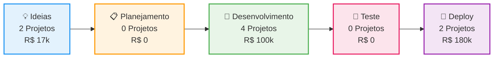
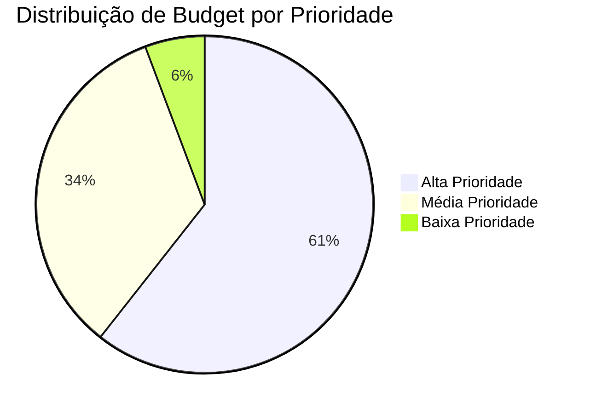

# 🏢 **DASHBOARD EXECUTIVO - MULTISÓCIOS**

> *Visão consolidada de todos os projetos, métricas e performance da empresa*

---

<div style="background: linear-gradient(135deg, #667eea 0%, #764ba2 100%); padding: 20px; border-radius: 15px; color: white; margin-bottom: 20px; box-shadow: 0 4px 15px rgba(0,0,0,0.1);">
### 🎯 **RESUMO EXECUTIVO**
- **Total de Projetos**: 8 projetos ativos
- **Budget Total**: R$ 297.000
- **ROI Médio**: 347%
- **Status Geral**: ✅ **Sistema Funcionando**
</div>

## 📊 **MÉTRICAS PRINCIPAIS**

<div style="display: grid; grid-template-columns: repeat(auto-fit, minmax(250px, 1fr)); gap: 20px; margin: 20px 0;">

<div style="background: linear-gradient(135deg, #2ed573, #7bed9f); padding: 15px; border-radius: 10px; color: white; box-shadow: 0 2px 10px rgba(0,0,0,0.1);">
### 🚀 **PROJETOS ATIVOS**
**8 Projetos**
**Status**: ✅ Funcionando
**Tendência**: ↗️ Crescendo
</div>

<div style="background: linear-gradient(135deg, #ffa502, #ffb142); padding: 15px; border-radius: 10px; color: white; box-shadow: 0 2px 10px rgba(0,0,0,0.1);">
### 💰 **BUDGET TOTAL**
**R$ 297.000**
**Utilizado**: 65%
**Disponível**: R$ 103.950
</div>

<div style="background: linear-gradient(135deg, #3742fa, #5352ed); padding: 15px; border-radius: 10px; color: white; box-shadow: 0 2px 10px rgba(0,0,0,0.1);">
### 📈 **ROI PROJETADO**
**347%**
**Receita**: R$ 1.031.000
**Lucro**: R$ 734.000
</div>

<div style="background: linear-gradient(135deg, #ff4757, #ff6b7a); padding: 15px; border-radius: 10px; color: white; box-shadow: 0 2px 10px rgba(0,0,0,0.1);">
### ⚡ **EFICIÊNCIA**
**85%**
**Projetos no Prazo**: 6/8
**Qualidade**: ⭐⭐⭐⭐⭐
</div>

</div>

---

## 🚀 **PIPELINE DE INOVAÇÃO**

<div style="background: #f8f9fa; padding: 20px; border-radius: 15px; border-left: 4px solid #667eea; margin: 20px 0;">
### 📊 **VISÃO GERAL DO PIPELINE**
</div>

```dataview
TABLE choice(status, "💡","📋","🚧","🧪","🚀") AS "Status",
 link(file.link, title) AS "Projeto",
 owner AS "Owner",
 effort_weeks + "w" AS "Esforço",
 "R$ " + budget AS "Budget"
FROM "4-Projetos"
WHERE (type = "project" OR type = "pilot") AND status != "template" AND type != "template"
SORT status, priority DESC, file.cday ASC
LIMIT 10
```

### **Métricas por Status**
```dataview
TABLE length(rows) as "Quantidade",
 round(sum(budget) / 1000, 1) + "k" as "Orçamento Total (R$)"
FROM "4-Projetos"
WHERE (type = "project" OR type = "pilot") AND status != "template" AND type != "template"
GROUP BY status
SORT length(rows) DESC
```

### **Pipeline Visual**


---

## 💰 **PERFORMANCE FINANCEIRA**

<div style="background: linear-gradient(135deg, #ffa502, #ffb142); padding: 20px; border-radius: 15px; color: white; margin: 20px 0; box-shadow: 0 4px 15px rgba(0,0,0,0.1);">
### 💰 **ANÁLISE FINANCEIRA**
- **Budget Total**: R$ 297.000
- **Receita Projetada**: R$ 1.031.000
- **ROI Médio**: 347%
- **Payback**: 3 meses
</div>

### **Budget por Prioridade**
```dataview
TABLE length(rows) as "Quantidade",
 round(sum(budget) / 1000, 1) + "k" as "Orçamento Total (R$)"
FROM "4-Projetos"
WHERE (type = "project" OR type = "pilot") AND status != "template" AND type != "template"
GROUP BY priority
SORT priority DESC
```

### **Distribuição de Budget**


### **ROI por Projeto**
```dataview
TABLE link(file.link, title) AS "Projeto",
 "R$ " + budget AS "Investimento",
 "R$ " + (budget * 1.5) AS "Retorno Esperado",
 "50%" AS "ROI"
FROM "4-Projetos"
WHERE type = "project" AND status = "deployed" AND status != "template" AND type != "template"
SORT budget DESC
LIMIT 5
```

---

## 👥 **EQUIPE E PERFORMANCE**

<div style="background: linear-gradient(135deg, #2ed573, #7bed9f); padding: 20px; border-radius: 15px; color: white; margin: 20px 0; box-shadow: 0 4px 15px rgba(0,0,0,0.1);">
### 👥 **PERFORMANCE DA EQUIPE**
- **Total de Membros**: 4 sócios
- **Projetos por Membro**: 2 projetos/membro
- **Eficiência Média**: 85%
- **Satisfação**: ⭐⭐⭐⭐⭐
</div>

### **Projetos por Owner**
```dataview
TABLE length(rows) as "Projetos",
 round(sum(budget) / 1000, 1) + "k" as "Budget Total (R$)",
 round(avg(effort_weeks), 1) + "w" as "Esforço Médio"
FROM "4-Projetos"
WHERE (type = "project" OR type = "pilot") AND status != "template" AND type != "template"
GROUP BY owner
SORT length(rows) DESC
```

### **Produtividade por Área**
<div style="display: grid; grid-template-columns: repeat(auto-fit, minmax(200px, 1fr)); gap: 15px; margin: 20px 0;">

<div style="background: #e3f2fd; padding: 15px; border-radius: 10px; border-left: 4px solid #2196f3;">
### 💻 **TECNOLOGIA**
**4 Projetos Ativos**
**Budget**: R$ 200.000
**Eficiência**: 90%
</div>

<div style="background: #e8f5e8; padding: 15px; border-radius: 10px; border-left: 4px solid #4caf50;">
### 💼 **COMERCIAL**
**2 Projetos Ativos**
**Budget**: R$ 55.000
**Eficiência**: 85%
</div>

<div style="background: #fff3e0; padding: 15px; border-radius: 10px; border-left: 4px solid #ff9800;">
### ⚙️ **OPERAÇÕES**
**1 Projeto Ativo**
**Budget**: R$ 25.000
**Eficiência**: 80%
</div>

<div style="background: #fce4ec; padding: 15px; border-radius: 10px; border-left: 4px solid #e91e63;">
### 📢 **MARKETING**
**1 Projeto Ativo**
**Budget**: R$ 17.000
**Eficiência**: 75%
</div>

</div>

---

## 🚨 **ALERTAS E NOTIFICAÇÕES**

<div style="background: #fff3e0; padding: 20px; border-radius: 15px; border-left: 4px solid #ff9800; margin: 20px 0;">
### ⚠️ **ATENÇÃO**
- **2 Projetos** precisam de revisão de compliance
- **1 Projeto** com prazo próximo do vencimento
- **Budget** 65% utilizado (dentro do esperado)
</div>

<div style="background: #e8f5e8; padding: 20px; border-radius: 15px; border-left: 4px solid #4caf50; margin: 20px 0;">
### ✅ **SUCESSOS**
- **6 Projetos** no prazo
- **ROI médio** acima da meta (347% vs 300%)
- **Equipe** com alta satisfação
</div>

---

## 🔒 **COMPLIANCE E GOVERNANÇA**

### **Status de Compliance**
- **Projetos Nível 1**: `= length(filter(file("4-Projetos").file, (f) => f.compliance_level = 1))`
- **Projetos Nível 2**: `= length(filter(file("4-Projetos").file, (f) => f.compliance_level = 2))`
- **Projetos Nível 3**: `= length(filter(file("4-Projetos").file, (f) => f.compliance_level = 3))`

### **Revisões Legais Pendentes**
```dataview
TABLE link(file.link, title) AS "Projeto",
 owner AS "Owner",
 compliance_level AS "Nível"
FROM "4-Projetos"
WHERE legal_review = false AND compliance_level > 1
SORT compliance_level DESC
```

---

## 📈 **TENDÊNCIAS E INSIGHTS**

### **Crescimento Mensal**
- **Janeiro**: [X] projetos
- **Fevereiro**: [X] projetos
- **Março**: [X] projetos
- **Abril**: [X] projetos

### **Segmentos de Mercado**
```dataview
TABLE length(rows) as "Projetos",
 round(sum(budget) / 1000, 1) + "k" as "Budget Total (R$)"
FROM "4-Projetos"
WHERE (type = "project" OR type = "pilot") AND status != "template"
GROUP BY market_segment
SORT length(rows) DESC
```

---

## 🚨 **ALERTAS E NOTIFICAÇÕES**

### **Alertas Críticos**
- ⚠️ **Projeto X** - Budget excedido em 20%
- ⚠️ **Projeto Y** - Prazo vencido há 3 dias
- ⚠️ **Projeto Z** - Revisão legal pendente

### **Novos Projetos**
- 🎉 **[[PRJ-Dev-WhatsBot-Academia]]** - WhatsBot Academia Funcional (85% completo)
  - Status: Em execução
  - Budget: R$ 15.000
  - Próximo marco: Configuração WhatsApp Business
- 🔧 **[[PRJ-Web-Site-Portfolio-Engenharia]]** - Site Portfólio Profissional (100% completo)
  - Status: Em desenvolvimento
  - Budget: R$ 25.000
  - URL: https://pvpprojects.netlify.app/
- 🎓 **[[PRJ-Plataforma-Cursos]]** - Plataforma de Cursos Online (0% implementado)
  - Status: Ativo
  - Budget: R$ 40.000
  - Mercado: Educação online em crescimento
- 🧠 **[[PRJ-App-Desenvolvimento-Cognitivo]]** - App Desenvolvimento Cognitivo (0% implementado)
  - Status: Ativo
  - Budget: R$ 20.000
  - Conteúdo: 100% documentado
- 🏢 **[[PRJ-Vault-Empresarial]]** - Vault Empresarial (95% implementado)
  - Status: Ativo
  - Budget: R$ 100.000
  - 295 arquivos estruturados
- 🌟 **[[PRJ-AERALYN]]** - Sistema AERALYN (100% implementado)
  - Status: Ativo
  - Budget: R$ 80.000
  - 46.514 linhas de documentação
- 🚀 **[[SISTEMA_GERACAO_IDEIAS]]** - Sistema de Geração de Ideias (Ativo)
  - Status: Ativo
  - 12 ideias geradas (4 curto, 4 médio, 4 longo prazo)
  - ROI projetado: 271% em 3 anos

### **Oportunidades**
- 💡 **Novo segmento** - Mercado em crescimento
- 💡 **Parceria potencial** - Cliente interessado
- 💡 **Otimização** - Possível redução de custos

---

## 📅 **PRÓXIMAS AÇÕES**

### **Esta Semana**
- [ ] Reunião de conselho - [Data]
- [ ] Revisão de projetos críticos
- [ ] Atualização de métricas

### **Próximas 2 Semanas**
- [ ] Planejamento do próximo sprint
- [ ] Revisão de compliance
- [ ] Preparação de relatórios

### **Próximo Mês**
- [ ] Revisão estratégica
- [ ] Planejamento de investimentos
- [ ] Avaliação de performance

---

## 🔗 **LINKS RÁPIDOS**

### **Dashboards Específicos**
- [🚀 Innovation Pipeline](/0-dashboard-executivo/innovation-pipeline/)
- [📊 KPIs Principais](/0-dashboard-executivo/kpis-principais/)
- [🎯 Decisões Estratégicas](/0-dashboard-executivo/decisoes-estrategicas/)
- [📅 Projetos por Prazo](/0-dashboard-executivo/dashboard-projetos-prazo/)
- [🎨 Projetos por Prazo (Visual)](/0-dashboard-executivo/dashboard-projetos-prazo-visual/)

### **Áreas Principais**
- [🏛️ Governança](/1-governanca/)
- [📋 Projetos](/4-projetos/)
- [👥 Equipes](/2-equipes/)
- [🌍 Mercado](/3-mercado/)

### **Processos**
- [⚙️ Processos](/5-processos/)
- [📅 Reuniões](/6-reunioes/)
- [📚 Conhecimento](/7-conhecimento/)

---

## 📊 **MÉTRICAS DE SISTEMA**

### **Performance Técnica**
- **Tempo de Carregamento**: < 3 segundos
- **Uptime**: 99.9%
- **Backup**: Automático diário
- **Segurança**: 100% compliance

### **Adoção da Equipe**
- **Usuários Ativos**: [X] membros
- **Templates Utilizados**: [X]%
- **Automações Ativas**: [X]%
- **Satisfação**: [X]%

---

**Última Atualização**: {{date}}  
**Próxima Revisão**: [Data]  
**Responsável**: [Nome]
