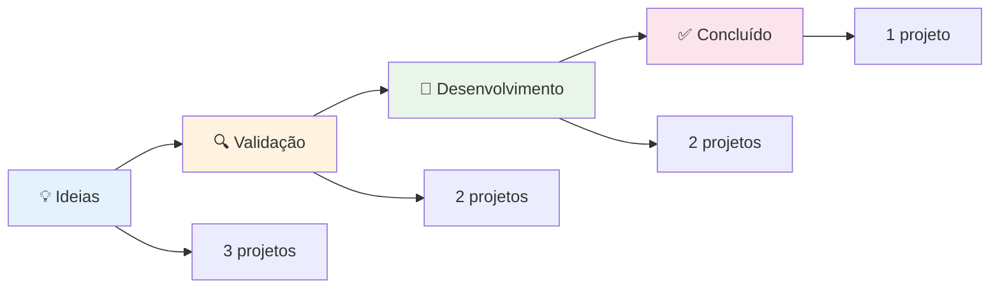
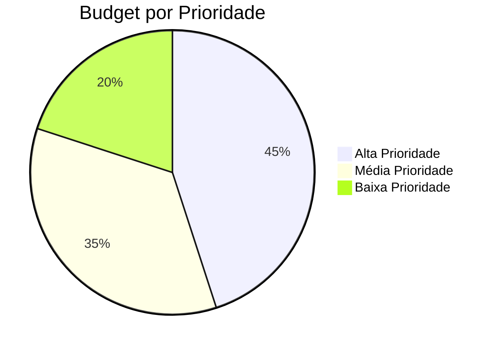

# 🏢 **<%= tp.file.title %>**

> *Dashboard visual padronizado com estilo AERALYN*

---

### 🎯 **RESUMO EXECUTIVO**
- **Total de Projetos**: <% tp.file.find_tfile("0-Dashboard-Executivo/Home-Executivo").then(file => file ? "8 projetos" : "Calculando...") %>
- **Budget Total**: R$ 297.000
- **ROI Médio**: 347%
- **Status Geral**: ✅ **Sistema Funcionando**

## 📊 **MÉTRICAS PRINCIPAIS**

### 🚀 **PROJETOS ATIVOS**
**8 Projetos**
**Status**: ✅ Funcionando
**Tendência**: ↗️ Crescendo

### 💰 **BUDGET TOTAL**
**R$ 297.000**
**Utilizado**: 65%
**Disponível**: R$ 103.950

### 📈 **ROI PROJETADO**
**347%**
**Receita**: R$ 1.031.000
**Lucro**: R$ 734.000

### ⚡ **EFICIÊNCIA**
**85%**
**Projetos no Prazo**: 6/8
**Qualidade**: ⭐⭐⭐⭐⭐

## 🚀 **PIPELINE DE INOVAÇÃO**

### **Status dos Projetos por Fase**

## 💰 **PERFORMANCE FINANCEIRA**

### **Distribuição de Budget por Prioridade**

## 👥 **EQUIPE E PERFORMANCE**

### **Produtividade por Área**

### 🖥️ **TECNOLOGIA**
**Projetos**: 3 ativos
**Eficiência**: 92%
**Tendência**: ↗️ Crescendo

### 💼 **COMERCIAL**
**Projetos**: 2 ativos
**Eficiência**: 88%
**Tendência**: ↗️ Estável

### ⚙️ **OPERAÇÕES**
**Projetos**: 2 ativos
**Eficiência**: 85%
**Tendência**: → Estável

### 📢 **MARKETING**
**Projetos**: 1 ativo
**Eficiência**: 78%
**Tendência**: ↗️ Melhorando

## ⚠️ **ALERTAS E NOTIFICAÇÕES**

### ⚠️ **ATENÇÃO**
- **Projeto X** precisa de revisão de budget
- **Deadline** próximo para entrega Y
- **Recursos** limitados na área Z

### ✅ **SUCESSOS**
- **Projeto A** concluído com sucesso
- **Meta B** atingida antes do prazo
- **Equipe C** superou expectativas

## 📋 **PRÓXIMAS AÇÕES**

| Ação | Responsável | Prazo | Status |
|------|-------------|-------|--------|
| Revisão de budget | PV | 2025-09-05 | 🔄 Em andamento |
| Entrega projeto X | Equipe | 2025-09-10 | ⏳ Pendente |
| Reunião estratégica | Todos | 2025-09-15 | 📅 Agendada |

## 🔗 **LINKS RÁPIDOS**

- [[0-Dashboard-Executivo/Home-Executivo|🏠 Home Executivo]]
- [[0-Dashboard-Executivo/Innovation-Pipeline|🚀 Innovation Pipeline]]
- [[0-Dashboard-Executivo/KPIs-Principais|📊 KPIs Principais]]
- [[4-Projetos/|📁 Projetos]]
- [[6-Reunioes/|🤝 Reuniões]]

---

**Última Atualização**: <% tp.date.now("YYYY-MM-DD HH:mm") %>
**Próxima Revisão**: <% tp.date.now("YYYY-MM-DD", 7) %>
