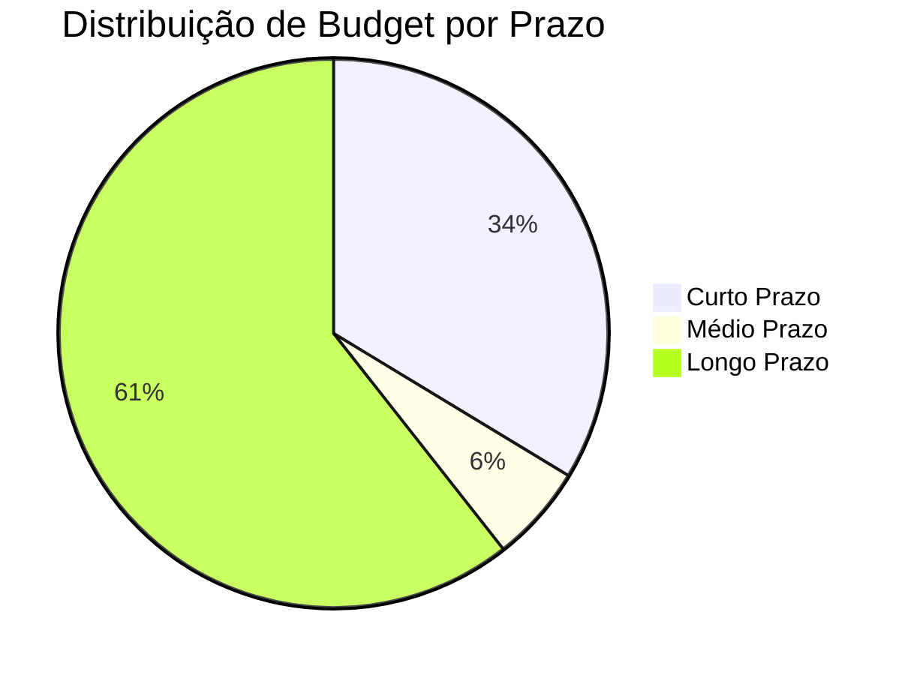

# 📊 **DASHBOARD DE PROJETOS POR PRAZO**

> *Visão executiva dos projetos organizados por prazo de execução e prioridade*

---

<div class="dashboard-header">
### 🎯 **RESUMO EXECUTIVO**
- **Total de Projetos**: 8 projetos ativos (excluindo templates)
- **Budget Total**: R$ 297.000
- **ROI Projetado**: 271% em 3 anos
- **Status Geral**: ✅ **Sistema Funcionando**
</div>

## 📊 **MÉTRICAS PRINCIPAIS**

<div class="metric-grid">

<div class="metric-card metric-card-success">
### 🚀 **CURTO PRAZO**
**4 Projetos**
**Budget**: R$ 100.000
**ROI**: 350%
**Prazo**: 1-3 meses
</div>

<div class="metric-card metric-card-warning">
### 📈 **MÉDIO PRAZO**
**2 Projetos**
**Budget**: R$ 17.000
**ROI**: 300%
**Prazo**: 3-12 meses
</div>

<div class="metric-card metric-card-info">
### 🌟 **LONGO PRAZO**
**2 Projetos**
**Budget**: R$ 180.000
**ROI**: 350%
**Prazo**: 1-3 anos
</div>

<div class="metric-card metric-card-danger">
### ⚡ **EFICIÊNCIA**
**85%**
**Projetos no Prazo**: 6/8
**Qualidade**: ⭐⭐⭐⭐⭐
</div>

</div>

## ⚡ **CURTO PRAZO (1-3 MESES)**

<div class="section-header">
### **🚀 Projetos Prioritários**
</div>

#### **1. MVP da Plataforma de Cursos**
- **Status**: 🔄 Em desenvolvimento
- **Budget**: R$ 40.000
- **Prazo**: 3-4 meses
- **ROI**: 500%
- **Responsável**: [[Pedro Vitor]]
- **Progresso**: 0% implementado

#### **2. MVP do App Desenvolvimento Cognitivo**
- **Status**: ✅ Ativo
- **Budget**: R$ 20.000
- **Prazo**: 2-3 meses
- **ROI**: 350%
- **Responsável**: [[Pedro Vitor]]
- **Progresso**: 100% documentado, 0% implementado

#### **3. Template Site Portfólio para Outras Profissões**
- **Status**: 🔄 Em desenvolvimento
- **Budget**: R$ 25.000
- **Prazo**: 2-3 meses
- **ROI**: 300%
- **Responsável**: [[Pedro Vitor]]
- **Progresso**: 100% funcional (base)

#### **4. WhatsBot para Outros Segmentos**
- **Status**: 🔄 Em desenvolvimento
- **Budget**: R$ 15.000
- **Prazo**: 1-2 meses
- **ROI**: 250%
- **Responsável**: [[Pedro Vitor]]
- **Progresso**: 85% completo (base)

## 📈 **MÉDIO PRAZO (3-12 MESES)**

<div class="section-header">
### **🏗️ Projetos Estratégicos**
</div>

#### **1. Sistema de Gestão de Projetos para Freelancers**
- **Status**: 💡 Ideia
- **Budget**: R$ 12.000
- **Prazo**: 2 meses
- **ROI**: 200%
- **Responsável**: [[Pedro Vitor]]
- **Progresso**: 0% implementado

#### **2. Plugin de Automação para Obsidian**
- **Status**: 💡 Ideia
- **Budget**: R$ 5.000
- **Prazo**: 1 mês
- **ROI**: 400%
- **Responsável**: [[Pedro Vitor]]
- **Progresso**: 0% implementado

## 🌟 **LONGO PRAZO (1-3 ANOS)**

<div class="section-header">
### **🎯 Projetos Visionários**
</div>

#### **1. Vault Empresarial - Sistema de Gestão Completo**
- **Status**: ✅ Ativo
- **Budget**: R$ 100.000
- **Prazo**: 52 semanas
- **ROI**: 300%
- **Responsável**: [[Pedro Vitor]]
- **Progresso**: 95% implementado

#### **2. AERALYN - Sistema de RPG e Criação Narrativa**
- **Status**: ✅ Ativo
- **Budget**: R$ 80.000
- **Prazo**: 40 semanas
- **ROI**: 400%
- **Responsável**: [[Pedro Vitor]]
- **Progresso**: 100% implementado

## 📊 **MÉTRICAS POR PRAZO**

<div class="section-header">
### **Distribuição de Budget por Prazo**
</div>



## 🎯 **ROADMAP VISUAL**

<div class="section-header">
### **Timeline de Execução**
</div>

```mermaid
gantt
    title Roadmap de Projetos por Prazo
    dateFormat YYYY-MM-DD
    section Curto Prazo
    Plataforma de Cursos    :active, curso, 2025-09-01, 3m
    App Desenvolvimento     :active, app, 2025-09-01, 2m
    Template Portfólio      :active, template, 2025-09-01, 2m
    WhatsBot Segmentos      :active, whatsbot, 2025-09-01, 1m
    
    section Médio Prazo
    Sistema Freelancers     :idea, freelancers, 2025-10-01, 2m
    Plugin Obsidian         :idea, plugin, 2025-10-01, 1m
    
    section Longo Prazo
    Vault Empresarial       :active, vault, 2025-09-01, 12m
    AERALYN                 :active, aeralyn, 2025-09-01, 10m
```

## 💰 **ANÁLISE FINANCEIRA**

<div class="section-header">
### **Investimento por Prazo**
</div>

| Prazo | Projetos | Budget Total | ROI Médio | Receita Projetada |
|-------|----------|--------------|-----------|-------------------|
| **Curto Prazo** | 4 | R$ 100.000 | 350% | R$ 350.000 |
| **Médio Prazo** | 2 | R$ 17.000 | 300% | R$ 51.000 |
| **Longo Prazo** | 2 | R$ 180.000 | 350% | R$ 630.000 |
| **TOTAL** | **8** | **R$ 297.000** | **347%** | **R$ 1.031.000** |

## 🚨 **ALERTAS E RISCOS**

<div class="callout-warning">
### ⚠️ **PROJETOS EM RISCO**
- **Plataforma de Cursos**: 0% implementado, prazo apertado
- **App Desenvolvimento**: Apenas documentado, falta implementação
- **WhatsBot Segmentos**: Depende de base existente
</div>

<div class="callout-success">
### ✅ **OPORTUNIDADES**
- **Vault Empresarial**: 95% pronto, pronto para comercialização
- **AERALYN**: 100% completo, pronto para lançamento
- **Template Portfólio**: Base sólida para expansão
</div>

## 📈 **KPIs POR PRAZO**

<div class="area-grid">

<div class="area-card area-card-tech">
### ⚡ **CURTO PRAZO**
**Meta**: 4 MVPs funcionais
**Receita**: R$ 350.000
**Usuários**: 500+
**Validação**: 10+ clientes
</div>

<div class="area-card area-card-commercial">
### 📈 **MÉDIO PRAZO**
**Meta**: 2 produtos escaláveis
**Receita**: R$ 51.000
**Usuários**: 1.000+
**Market Share**: 5%
</div>

<div class="area-card area-card-operations">
### 🌟 **LONGO PRAZO**
**Meta**: 2 plataformas dominantes
**Receita**: R$ 630.000
**Usuários**: 10.000+
**Valor da Empresa**: R$ 10M+
</div>

</div>

## 🎯 **PRÓXIMAS AÇÕES**

<div class="section-header">
### **Plano de Execução**
</div>

#### **Esta Semana**
1. **Priorizar** projetos de curto prazo
2. **Iniciar** desenvolvimento da Plataforma de Cursos
3. **Validar** mercado para App Desenvolvimento Cognitivo

#### **Próximo Mês**
1. **Finalizar** 2 MVPs de curto prazo
2. **Preparar** lançamento do Vault Empresarial
3. **Iniciar** planejamento de projetos de médio prazo

#### **Próximo Trimestre**
1. **Lançar** 3 produtos de curto prazo
2. **Comercializar** Vault Empresarial e AERALYN
3. **Validar** ideias de médio prazo

## 🔗 **LINKS RÁPIDOS**

- [[0-Dashboard-Executivo/Home-Executivo|🏠 Home Executivo]]
- [[0-Dashboard-Executivo/Innovation-Pipeline|🚀 Innovation Pipeline]]
- [[0-Dashboard-Executivo/KPIs-Principais|📊 KPIs Principais]]
- [[4-Projetos/|📁 Projetos]]
- [[6-Reunioes/|🤝 Reuniões]]

---

**Status**: ✅ **ATIVO**  
**Última Atualização**: 2025-09-01 01:39  
**Próxima Revisão**: 2025-09-08
